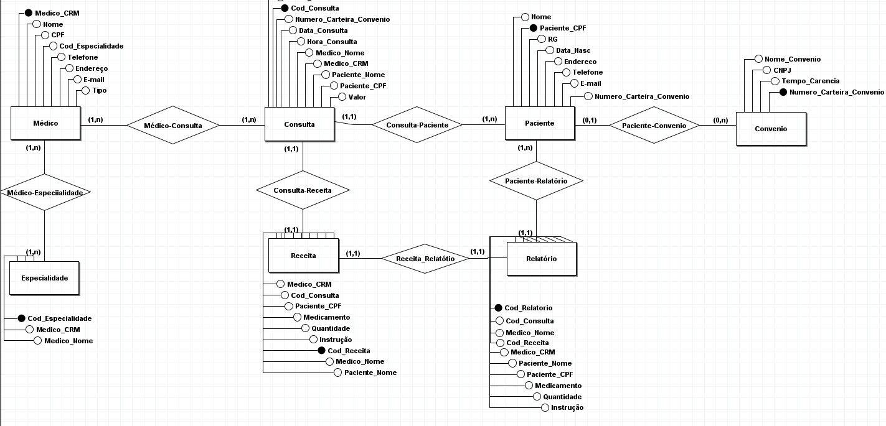

# Banco-do-Hospital-Fundamental
Atividade proposta pelo professor Gabriel - Elaborar as etapas de criação de um banco de dados para o Hospital Fundamental.

# Etapa 1

A primeira etapa foi a diagramação DER, é a primeira vez que utilizo a ferramenta BRModelo, também estou me adaptando novamente com as cardinalidades e estudando as com 0, não tive a chance de conhecê-lás antes, mas quero usar no meu próximo diagrama.

## Entidades:

1. **Paciente:** Representa os indivíduos que recebem tratamento médico no hospital. Cada paciente é identificado por um código único.

2. **Médico:** Representa os profissionais de saúde que realizam consultas e prescrevem tratamentos para os pacientes. Cada médico é identificado por um código único.

3. **Consulta:** Representa as interações entre médicos e pacientes, onde o diagnóstico e o tratamento são discutidos e prescritos. Cada consulta é identificada por um número único e está associada a um único paciente (cardinalidade "1..1") e a um ou mais médicos (cardinalidade "1..n").

4. **Convênio:** Representa os planos de saúde ou seguros médicos aos quais os pacientes podem estar afiliados. Cada convênio é identificado por um código único e pode ter zero ou mais pacientes associados a ele (cardinalidade "1..n").

5. **Receita:** Representa as prescrições médicas feitas durante uma consulta. Cada receita é identificada por um número único e está associada a uma única consulta (cardinalidade "1..1").

6. **Relatório de Receita:** Representa uma cópia ou registro da receita médica que é entregue ao paciente. Cada relatório de receita está associado a uma única receita (cardinalidade "1..1") e, por extensão, a uma única consulta e a um único paciente.

## Relacionamentos:

- **Paciente - Consulta:** Um paciente pode ter uma ou mais consultas, mas cada consulta está associada a apenas um paciente (cardinalidade "1..n" do lado do Paciente e "1..1" do lado da Consulta).

- **Médico - Consulta:** Cada consulta é realizada por um ou mais médicos, mas cada médico pode estar associado a várias consultas (cardinalidade "1..n").

- **Paciente - Convênio:** Cada paciente pode estar associado a zero ou um convênio, e cada convênio pode ter zero ou mais pacientes associados a ele (cardinalidade "0..1" do lado do Paciente e "0..n" do lado do Convênio).

- **Consulta - Receita:** Cada consulta resulta em uma prescrição médica, portanto, cada receita está associada a uma única consulta (cardinalidade "1..1").

- **Receita - Relatório de Receita:** Cada receita tem um relatório correspondente que é entregue ao paciente, portanto, cada relatório de receita está associado a uma única receita (cardinalidade "1..1").
